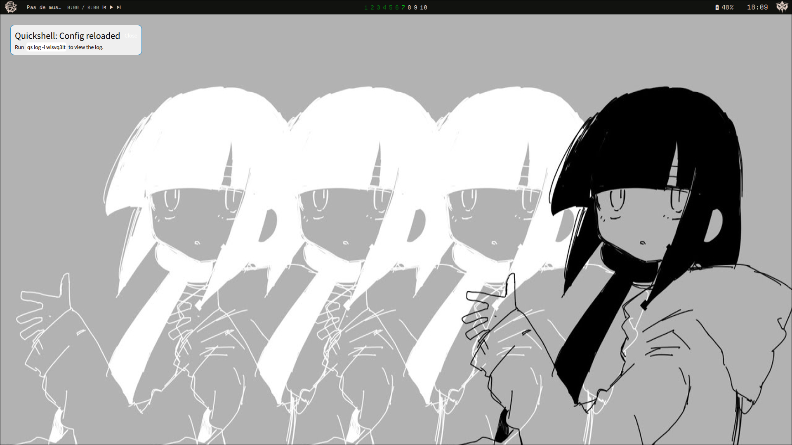
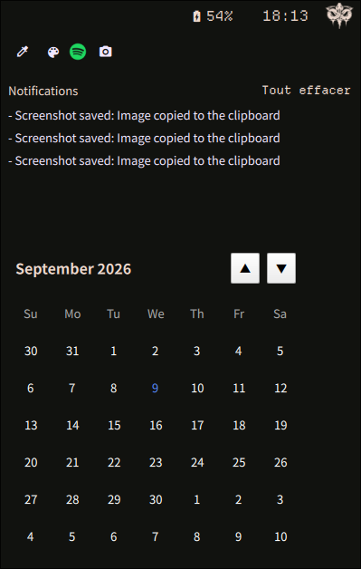
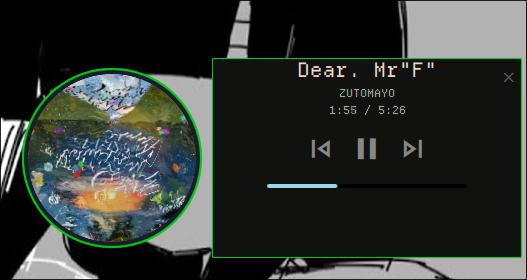

### WIP  
my quickshell config

## features 
calendar and notification center
 

an integrated music player
 

## TODO
finish the main panel 
create a luminosity and sound popup  
make a new notification popup  
update the visual of the widgets  
optimise images to lower their sizes  

https://github.com/samyns/Unit-3 for the notification popup
